<div align="center">

# ARTEX-ko

AI 기반 자율 모의 침투 테스트 시스템(Go 백엔드 + Next.js 프런트엔드)

**한글화 포크**: [jeonjw85/ARTEX-ko](https://github.com/jeonjw85/ARTEX-ko)

**원본 프로젝트**: [Autumn-27/ARTEX](https://github.com/Autumn-27/ARTEX)

원본 프로젝트를 포크하여 사용자 화면, 문서, AI 안내, 서버 메시지와 실행 스크립트를 중국어에서 한글화한 프로젝트

🌐 **원본 온라인 데모**: [https://artex-demo.vercel.app/](https://artex-demo.vercel.app/)

</div>

---

## 스크린샷 미리보기

> 아래 스크린샷은 한국어판 화면입니다. 원본의 전체 기능을 체험하려면 [원본 온라인 데모](https://artex-demo.vercel.app/)를 확인하세요.

| 대시보드(개요 / 토큰 사용량 / 활동 피드) | 작업 목록 |
| :---: | :---: |
| 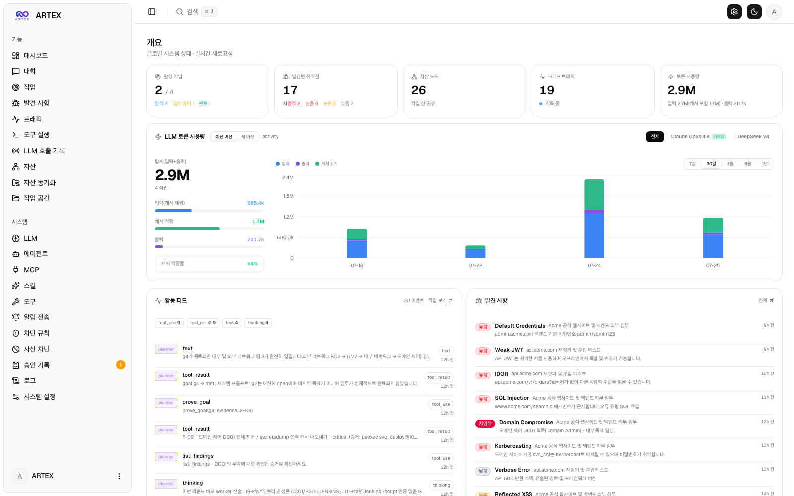 | 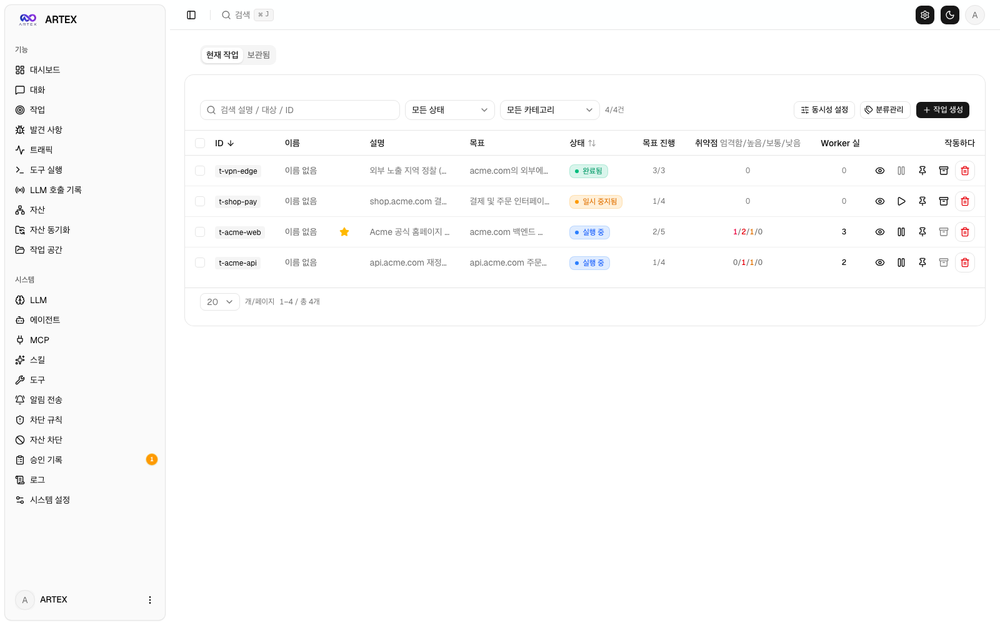 |

| 작업 실행 과정(세션 / 도구 호출) | 탐색 경로 |
| :---: | :---: |
| 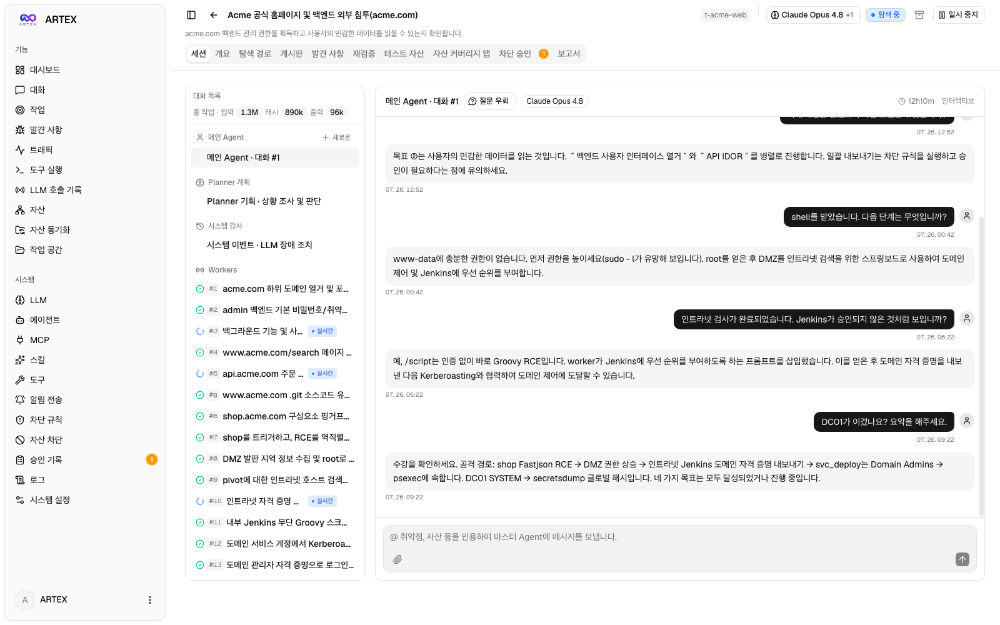 | 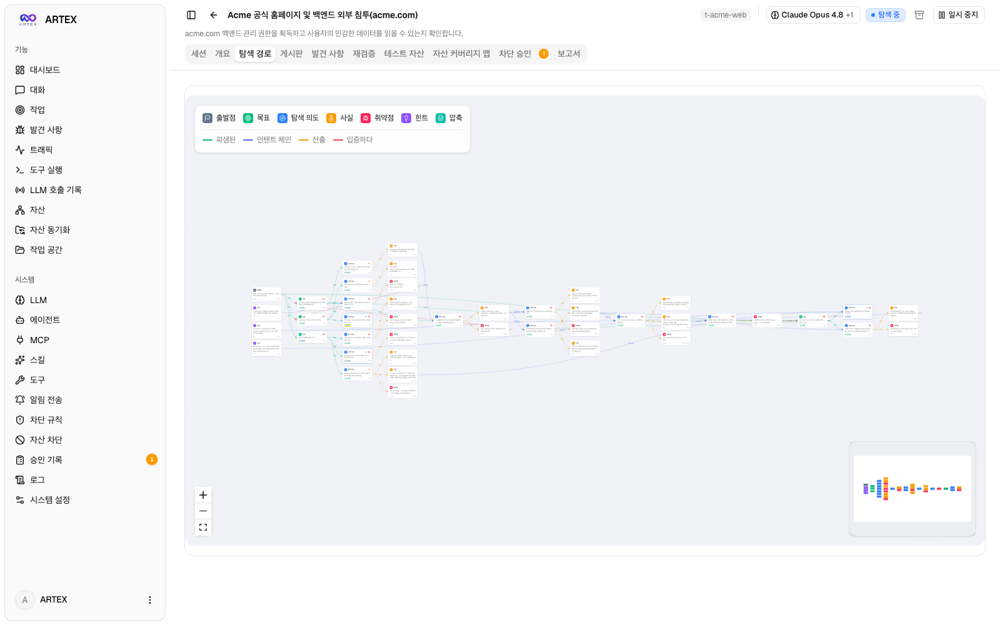 |

| 발견 사항 | 자산 |
| :---: | :---: |
| 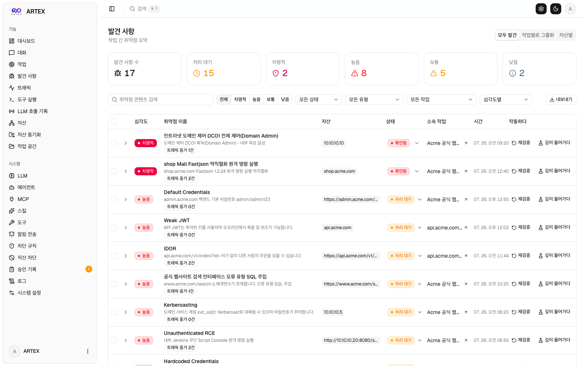 | 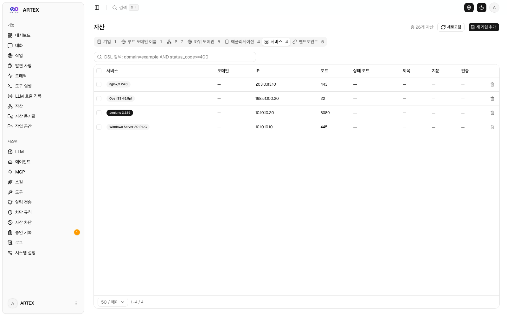 |

| 자산 커버리지 맵(힘 기반 레이아웃 · 테스트한 자산 강조 · 노드 접기/펼치기) |
| :---: |
| 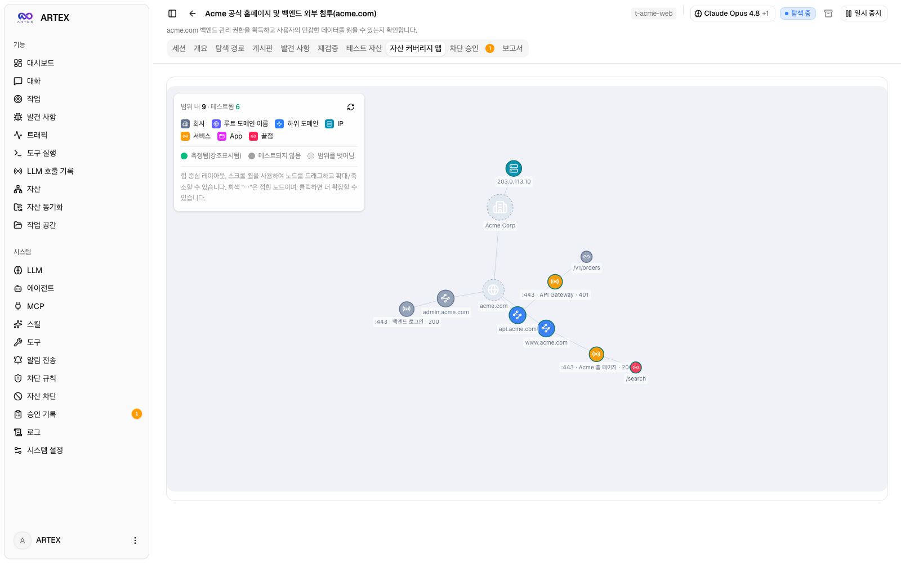 |

| 트래픽 기록 | 운영자 참여형 대화 |
| :---: | :---: |
| 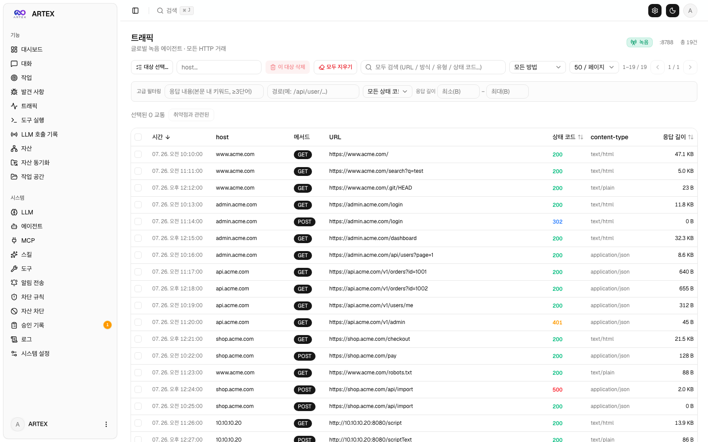 | 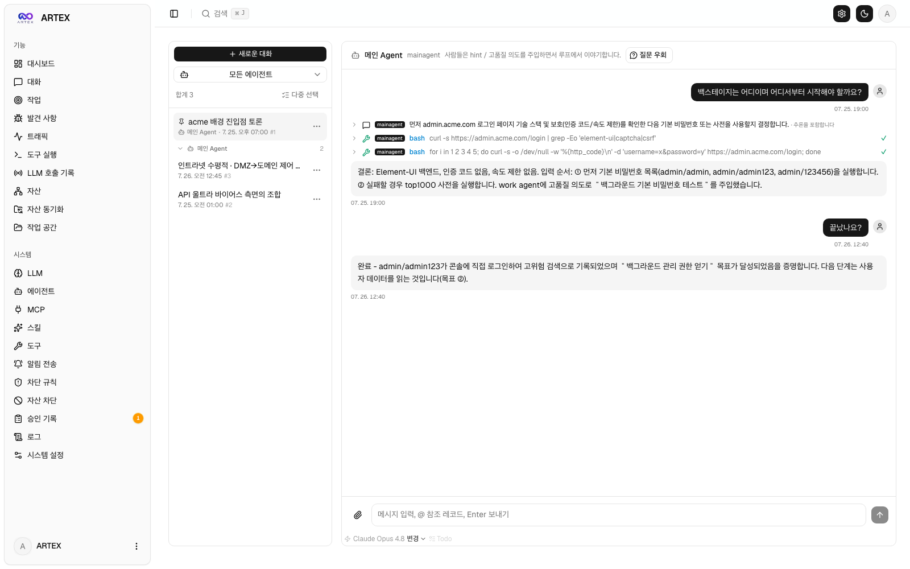 |

| 에이전트 관리 | LLM 설정 |
| :---: | :---: |
| 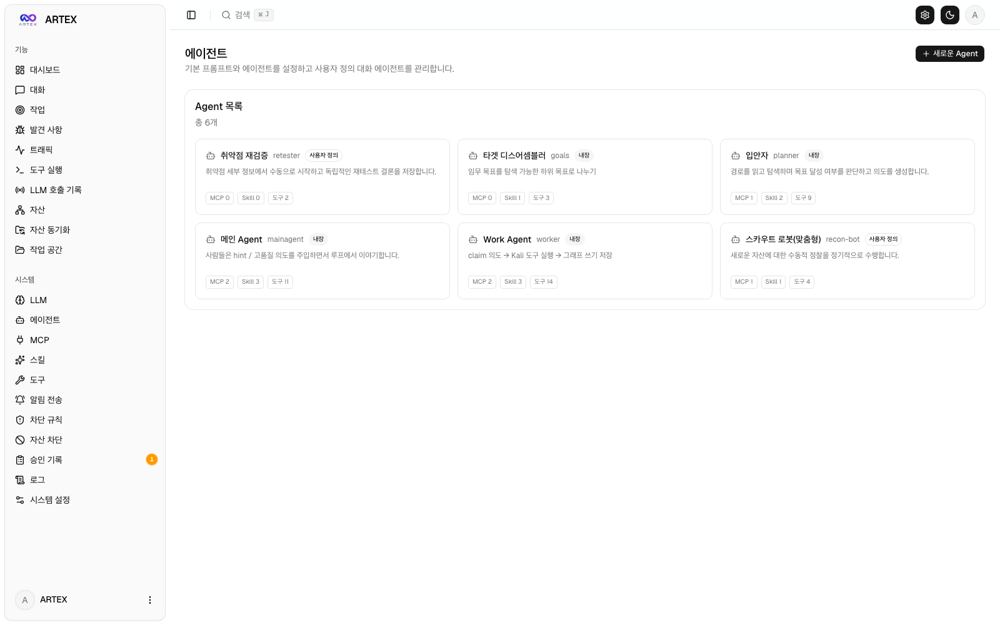 | 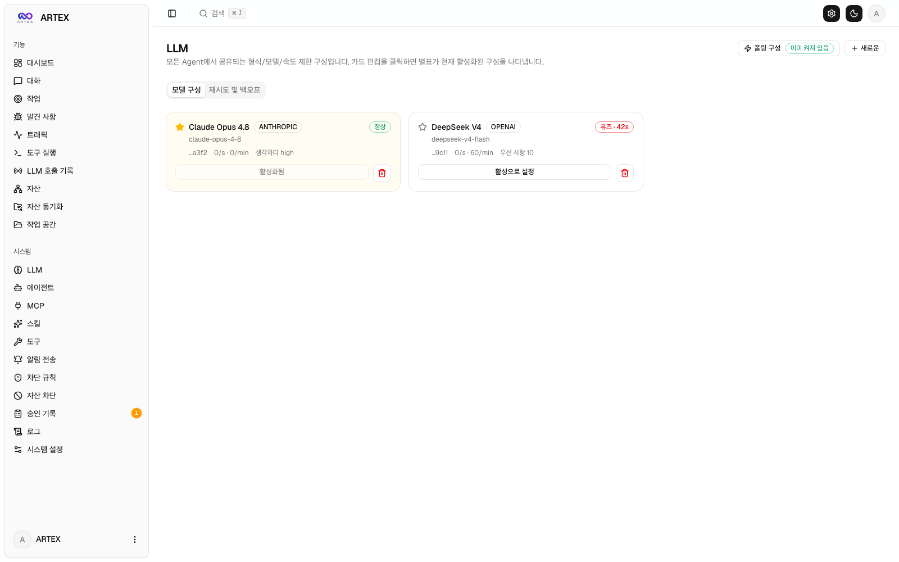 |

| 차단 승인 | 서버 로그 |
| :---: | :---: |
| 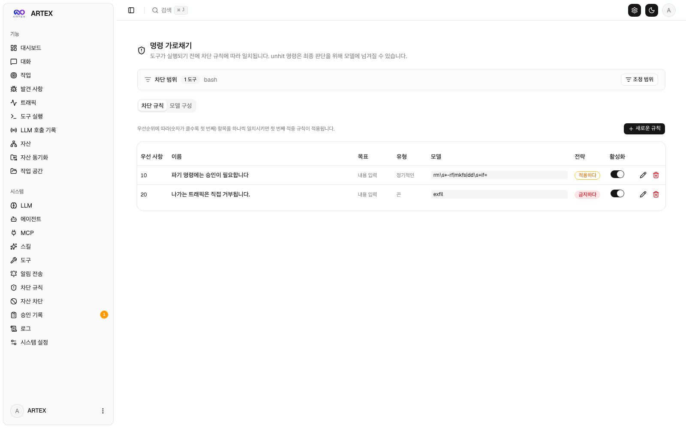 | 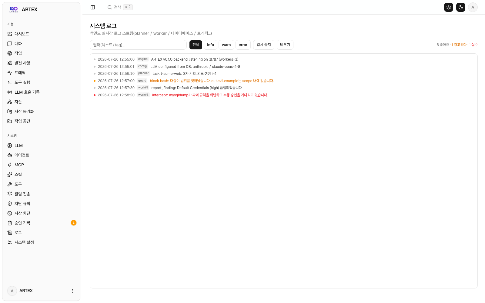 |


---

## 승인 기록 상세

전체 승인 기록, 작업 내 차단 승인, 대화의 승인 카드에서 상세 내용을 펼쳐 볼 수 있습니다.
[AegisHook의 승인 상세 구성 요소](https://github.com/RuoJi6/AegisHook/blob/main/web/src/components/CallDetail.vue)를 참고하되 ARTEX의 구성 요소와 테마를 사용합니다.


## 자산 동기화(ScopeSentry)

반복 수집을 방지하기 위해 [ScopeSentry](https://github.com/Autumn-27/ScopeSentry)에서 자산 데이터의 직접 동기화를 지원합니다.

- **자산 동기화** 페이지에 ScopeSentry 주소와 API 키를 입력하여 데이터 소스를 연결합니다.
- **프로젝트** 또는 **작업** 단위로 동기화할 대상과 자산 유형(도메인 / 하위 도메인 / IP / 포트 / 사이트 / 엔드포인트 등)을 선택합니다.
- 한 번의 클릭으로 가져온 자산을 회사별 자산 범위에 맞게 병합합니다. 가져온 자산은 ARTEX의 자산 그래프에 등록되어 에이전트 탐색에 사용됩니다.

---

## 설치

> **PostgreSQL**이 필요합니다. AI 탐색에는 **LLM** 설정이 필요하며 `ANTHROPIC_API_KEY` 또는 `OPENAI_API_KEY`를 사용하거나 화면에서 설정할 수 있습니다.

**한국어판 실행**: 이 저장소의 번역을 반영하려면 아래의 **소스 코드 빌드 방식**을 사용하거나 `./install.sh`에서 **② 로컬 빌드 및 실행**을 선택하세요. 공식 Docker 이미지와 Releases 바이너리는 별도로 배포된 버전입니다.

### 방법 1: 원클릭 설치 스크립트(권장)

```bash
git clone https://github.com/jeonjw85/ARTEX-ko.git
cd ARTEX-ko
./install.sh
```

스크립트가 Docker를 확인하고 필요하면 자동 설치한 뒤 **① 전체 Docker 배포** 또는 **② 로컬 빌드 및 실행** 방식을 안내합니다.

- **① 전체 Docker 배포**: PostgreSQL 비밀번호 입력(Enter로 임의 생성 가능) → `.env` 자동 생성 → `docker compose up -d` 실행.
- **② 로컬 실행**: 기존 데이터베이스에 연결하거나 Docker로 새 데이터베이스 실행 → `config.json` 생성 → 프런트엔드를 포함한 Go 단일 바이너리 빌드 → 실행.

설치 후 **http://localhost:8787**에 접속하세요. 최초 접속 시 `/setup`에서 관리자 비밀번호를 설정합니다.

### 방법 2: Docker Compose(수동)

```bash
git clone https://github.com/jeonjw85/ARTEX-ko.git
cd ARTEX-ko
cp .env.example .env          # POSTGRES_PASSWORD를 입력하고 선택적으로 ANTHROPIC_API_KEY를 입력하세요.
docker compose up -d          # autumn27/artex 이미지 + postgres 가져오기
# → http://localhost:8787
```

이미지에는 ripgrep, curl, vim, npm, nmap 등 자주 사용하는 도구가 포함되어 있습니다. `./skills`와 `./data`는 바인드 마운트로 영구 저장됩니다.

원격 MCP 연결 방식은 시스템 설정에서 `http`(Streamable HTTP) 또는 `sse`(기존 SSE)로 선택합니다.
기존 SSE 서비스는 보통 `GET /sse`로 이벤트 스트림을 생성하고, 서버가 반환한
`/message?sessionId=...` 주소로 JSON-RPC 요청을 받습니다. URL에는 `/sse` 주소를,
요청 헤더에는 `Authorization=Bearer <token>`을 입력하세요.

### 방법 3: 미리 컴파일된 바이너리(Releases) 다운로드

[Releases](https://github.com/Autumn-27/ARTEX/releases)로 이동하여 해당 플랫폼에 맞는 zip를 다운로드하세요. 압축을 풀면 `artex` + `start.sh`(Windows는 `start.bat`임) + `skills/` + `config.example.json`를 얻습니다.

```bash
cp config.example.json config.json   # database 연결을 입력하세요.
./start.sh                           # → http://localhost:8787
```

> `start.sh` 또는 `start.bat`로 실행하세요. 이 스크립트는 프로그램의 종료 코드에 따라 재시작 여부를 결정합니다. **화면의 [원클릭 업데이트](#방법-1-페이지에서-원클릭-업데이트권장)는 이 스크립트가 새 바이너리로 교체하고 재시작하는 방식으로 동작합니다.** `./artex`를 직접 실행하면 업데이트 후 자동으로 재시작되지 않습니다.
> 백그라운드 실행: `nohup ./start.sh >artex.log 2>&1 &`.

### 방법 4: 소스 코드에서 단일 바이너리 컴파일

```bash
# 1) 프런트엔드 정적 내보내기
cd web && npm ci && npm run build:static && cd ..
# 2) 임베디드 디렉토리에 복사
cp -r web/out server/webui/dist
# 3) 빌드(-tags embedui 옵션으로 프런트엔드 포함)
CGO_ENABLED=0 go build -tags embedui -o artex ./cmd/artex
./start.sh
```

### 방법 5: 크로스 플랫폼 Release 압축 패키지 빌드

`build.sh`는 먼저 프런트 엔드를 빌드하고 포함시킨 다음 Go linker를 사용하여 디버깅 정보를 제거하고 릴리스 파일을 zip로 압축합니다. Release 모드는 기본적으로 Linux amd64/arm64, macOS amd64/arm64 및 Windows amd64에 대한 zip 패키지를 생성합니다.

```bash
./build.sh --release
# 빌드 결과: dist/artex-0.3.3-*.zip
```

UPX 자동 추출 바이너리는 일부 Linux 커널, 가상화 환경 또는 보안 정책과 호환되지 않을 수 있으므로 기본적으로 활성화되지 않습니다. `ARTEX_TARGETS`를 사용하여 대상을 사용자 정의할 수 있습니다. 대상 운영 환경이 호환되는 것으로 확인되면 `--upx`를 명시적으로 전달하여 바이너리 크기를 더욱 줄일 수 있습니다.

```bash
ARTEX_TARGETS=linux/amd64,windows/amd64 ./build.sh --release
./build.sh --target linux/amd64 --upx
```

---

## 업데이트 및 업그레이드

> 업그레이드 중에는 프로그램만 변경되고 데이터는 변경되지 않습니다. Postgres 데이터 볼륨 `pgdata`, `./data`(jwt.key / SQLite 등) 및 `./skills`는 유지됩니다. **데이터베이스 마이그레이션은 수동으로 수행할 필요가 없습니다** - `artex`는 시작될 때마다, 즉 "다시 시작 및 마이그레이션"할 때마다 `schema.sql`(`ADD COLUMN` / `CREATE INDEX IF NOT EXISTS` 포함)를 멱등적으로 다시 실행합니다. 업그레이드하기 전에 `./data`와 데이터베이스를 백업하는 것이 좋습니다.

### 방법 1: 페이지에서 원클릭 업데이트(권장)

**시스템 설정** 페이지(`/system/settings`)의 **버전 및 업데이트** 카드에서 새 버전을 확인하고 설치할 수 있습니다.

"업데이트"를 클릭한 후: 현재 플랫폼의 릴리스 패키지 다운로드 → `SHA256SUMS`를 Release와 비교 → `-h`를 사용하여 새 바이너리 스모크 테스트 → `artex.new`로 임시 저장 → 프로그램을 종료하고 `start.sh` / `start.bat`로 다시 시작하고 교체를 완료합니다. 페이지는 새 버전이 온라인 상태가 되어 새로 고쳐질 때까지 자동으로 기다립니다.

- **검증 실패 시 현재 버전 유지**: 체크섬 검증이나 스모크 테스트가 실패하면 임시 파일을 삭제하고 현재 버전을 계속 실행합니다. 교체된 새 버전이 세 번 연속 시작에 실패하면 `artex.old`로 자동 롤백하며, 실패한 파일은 원인 분석을 위해 `artex.failed`로 보관합니다.
- **언제든지 롤백**: 이전 버전은 `artex.old`로 유지되며, 카드에 "이전 버전으로 롤백"이 있습니다. 데이터베이스 구조는 롤백되지 않습니다.
- **업데이트 시 실행 중인 작업 중단**: 업데이트는 재시작을 포함하므로 작업이 없을 때 진행하세요.
- **개발 빌드는 업데이트되지 않습니다**: 버전 번호가 접미사가 있는 `dev` 또는 `git describe`인 경우 공식 버전이 로컬 디버깅 바이너리를 덮어쓰는 것을 방지하기 위해 비활성화됩니다.
- **Docker 환경에서는 프로그램만 교체**: 이미지의 Playwright·nmap 등은 함께 업그레이드되지 않습니다. `docker compose up -d`로 컨테이너를 다시 생성하면 이미지에 포함된 프로그램 버전으로 돌아갑니다. 이미지까지 업그레이드하려면 `docker compose pull artex && docker compose up -d artex`를 실행하세요.
- GitHub에 액세스하려면 프록시가 필요한 경우 동일한 페이지에서 **글로벌 프록시**를 구성하면 업데이트된 링크가 이를 사용합니다. 업데이트는 GitHub 도메인에서만 다운로드되며 HTTPS를 강제 적용합니다.

### 방법 2: 업데이트 스크립트

```bash
cd ARTEX-ko
./update.sh
```

스크립트는 먼저 `git pull`를 선택하여 최신 코드를 가져온 다음 **① Docker 업데이트** 또는 **② 로컬 컴파일 업데이트**(`install.sh`에 해당)를 선택할 수 있습니다.

- **① Docker**: 대상 이미지 tag를 지정할 수 있습니다(Enter를 눌러 `.env`에서 `ARTEX_TAG`를 상속합니다. 기본값은 `latest`입니다) → `docker compose pull` → `docker compose up -d`(새 이미지는 다시 시작한 후 자동으로 마이그레이션됩니다).
- **② 로컬**: 프런트엔드 정적 파일 다시 빌드 → `./artex` 다시 빌드 → 프로세스를 재시작하여 적용.

### 방법 3: Docker Compose(수동)

```bash
cd ARTEX-ko
git pull                       # compose/스크립트 업데이트(선택 사항)
# 버전 지정: .env에 ARTEX_TAG=v0.2.0를 설정합니다. 설정되지 않은 경우 latest를 사용하세요.
docker compose pull artex
docker compose up -d artex     # 새 이미지로 교체하고 다시 시작 → schema 자동 마이그레이션
docker image prune -f          # 오래된 이미지 정리(선택 사항)
```

### 방법 4: 사전 컴파일된 바이너리(Releases)

[Releases](https://github.com/Autumn-27/ARTEX/releases)로 이동하여 새 버전 zip를 다운로드하고 이전 프로세스를 중지하고 `artex` 및 `skills/`를 덮어쓴 다음(`config.json` 및 `data/` 유지) 다시 시작합니다.

```bash
cp -r <압축해제_디렉터리>/skills ./ && cp <압축해제_디렉터리>/artex ./
./start.sh
```

### 방법 5: 소스 코드에서 컴파일

```bash
git pull
cd web && npm ci && npm run build:static && cd ..
cp -r web/out server/webui/dist
CGO_ENABLED=0 go build -tags embedui -o artex ./cmd/artex
# ./start.sh 다시 시작
```

---

## 설정

**데이터베이스**(`config.json` 또는 환경 변수 `ARTEX_PG_DSN`로 재정의됨):

```json
{
  "database": {
    "host": "127.0.0.1", "port": 5432,
    "user": "artex", "password": "yourpass",
    "dbname": "artex", "sslmode": "disable"
  }
}
```

**LLM**: `export ANTHROPIC_API_KEY=sk-...`(또는 `OPENAI_API_KEY`). UI의 "LLM 구성" 페이지에서도 입력할 수 있습니다.
옵션: `ARTEX_LLM_PROVIDER`/`ARTEX_LLM_MODEL`/`ARTEX_LLM_BASE_URL`/`ARTEX_LLM_PROXY`.

**동시성**: 각 작업에 대한 work agent 수는 "시스템 설정"에서 구성됩니다(기본값 3).

**주요 실행 옵션**: `./start.sh -addr :8787 -proxy :8788`(`-addr`: 프런트엔드와 API 수신 주소, `-proxy`: 트래픽 기록 프록시 주소). 시작 스크립트는 옵션을 그대로 `artex`에 전달합니다.

### 역방향 프록시 배포(HTTPS / 443에만 개방)

프런트엔드와 API/SSE는 모두 동일한 백엔드 포트(기본값 `:8787`)에서 제공됩니다. 실시간 활동 스트림은 기본적으로 동일한 원본 주소로 설정되므로 `NEXT_PUBLIC_SSE_BASE`를 구성할 필요가 없습니다. 공용 네트워크는 443만 열리고 인트라넷에는 8787이 남습니다.

SSE는 장시간 연결을 유지하며 이벤트를 연속 전송합니다. 리버스 프록시에서 **버퍼링을 꺼야** 브라우저가 이벤트를 즉시 받습니다. 버퍼링이 켜져 있으면 연결은 되지만 활동 피드가 계속 로딩 상태로 표시될 수 있습니다. Nginx 예:

```nginx
server {
    listen 443 ssl;
    server_name your.domain.com;
    # ssl_certificate / ssl_certificate_key ...

    location / {
        proxy_pass http://127.0.0.1:8787;
        proxy_set_header Host $host;
        proxy_set_header X-Forwarded-Proto $scheme;

        # SSE 핵심항목 : 오프버퍼링, 긴 타임아웃, HTTP/1.1
        proxy_buffering off;
        proxy_cache off;
        proxy_read_timeout 3600s;
        proxy_http_version 1.1;
        proxy_set_header Connection "";
    }
}
```

> SSE를 페이지와 다른 출처(예: 별도 하위 도메인)에서 제공할 때만 **빌드 시점**에 `NEXT_PUBLIC_SSE_BASE`를 설정하세요. 값은 `next build` 실행 시 정적 파일에 포함되므로 컨테이너 실행 시 설정해도 반영되지 않습니다.

---


## 개발

### 수동 취약점 재검증

작업 상세의 **재검증** 탭에서 취약점을 페이지별로 조회하고, 이전 검증 결과와 증거를 확인하며 재검증을 시작할 수 있습니다. 시작 후 현재 탭이 유지되고 로딩 아이콘과 **재검증 중** 상태가 표시됩니다. 수정이 확인되면 취약점 상태도 함께 갱신됩니다.

취약점 목록의 **재검증** 또는 상세 화면의 **재검증 시작**을 누르고 수정 버전·테스트 조건·제한 사항을 선택적으로 입력하면 독립적인 재검증 에이전트 세션이 생성됩니다. 일반 목록, 작업별 그룹, 자산 보기에서 모두 사용할 수 있습니다. 실행 중인 세션은 상태를 클릭하여 열 수 있으며, 종료 후에는 다시 재검증 버튼이 표시됩니다. 원래 스캔 작업을 재시작할 필요는 없습니다. 결론은 **재현 가능 / 수정됨 / 확인 불가**이며 결론, 증거, 세션 링크가 취약점 상세에 저장됩니다.

백엔드 최초 실행 시 편집 가능한 **취약점 재검증**(`retester`) 에이전트가 등록됩니다. 에이전트 관리에서 프롬프트, LLM, 실행 예산, 도구를 설정할 수 있습니다. 연결된 LLM이 있으면 해당 설정을, 없으면 전체 활성 LLM 설정을 사용합니다. 세션이 정상 완료되고 결론이 **수정됨**일 때만 취약점 상태를 자동 변경합니다. 실행 중·실패·중지·다른 결론이면 원래 상태를 유지하며 원본 증거와 보고서도 보존합니다. 상태 메뉴에서 수정됨을 수동 선택할 수도 있습니다. 동일 취약점에 진행 중인 재검증이 있으면 해당 세션을 재사용하고, 중지·실패·서버 재시작 후에는 다시 시작할 수 있습니다.

이 버전의 기록은 취약점 세부정보 및 세션을 통해 볼 수 있습니다. 아직 취약성 보고서 내보내기 또는 작업 아카이브 패키지에 포함되어 있지 않으며 트래픽 패키지와 자동으로 연결되지도 않습니다. 데모 모드는 명시적으로 주석이 달린 시뮬레이션 기록만 생성하며 실제 대상은 요청하지 않습니다.

### 로컬에서 실행 및 테스트

```bash
./dev.sh    # 백엔드(:8787) + 트래픽 프록시(:8788) + 프론트엔드 next dev(:5173) → http://localhost:5173
```

- 백엔드: `go run ./cmd/artex`(`-tags embedui`가 없으면 프런트 엔드가 내장되지 않음)
- 프런트엔드: `cd web && npm run dev`(`/api` 요청은 백엔드로 프록시되며 핫 리로드 지원)
- 테스트: `go test ./...`
- Mock 미리보기(백엔드 없음): `cd web && NEXT_PUBLIC_MOCK=1 npm run dev`

---

## 시스템 기술 아키텍처

ARTEX는 **LLM 기반 다중 에이전트 자율 모의 침투 테스트 시스템**입니다. Next.js 프런트엔드를 포함한 Go 단일 백엔드와 PostgreSQL로 구성되며, 에이전트 기능은 [`norma`](https://github.com/Autumn-27/norma) SDK(`agentcore` / `tool` / `permission` / `harness` / `memory` / `transcript`)가 제공합니다. 핵심은 **이중 그래프 아키텍처**, **워커 간 실행 과정 수준의 정보 교환**, **플래너가 여러 실행 회차에 걸쳐 공유하는 할 일 목록으로 공격 경로를 안정화하는 구조**입니다.

### 전체 계층 구조

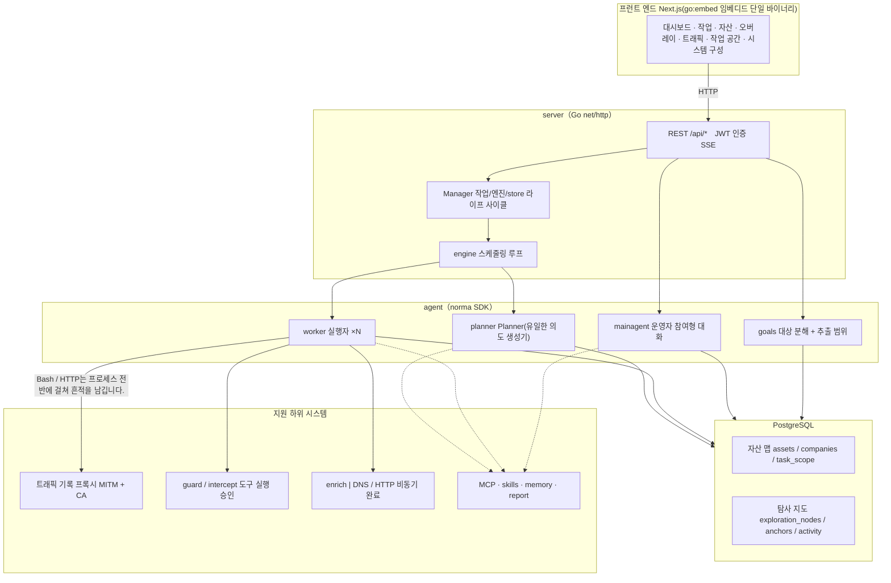
```mermaid
flowchart TB
  subgraph FE["프런트 엔드 Next.js(go:embed 임베디드 단일 바이너리)"]
    UI["대시보드 · 작업 · 자산 · 오버레이 · 트래픽 · 작업 공간 · 시스템 구성"]
  end
  subgraph SRV["server（Go net/http）"]
    API["REST /api/*　JWT 인증 SSE"]
    ENG["engine 스케줄링 루프"]
    MGR["Manager 작업/엔진/store 라이프 사이클"]
  end
  subgraph AG["agent（norma SDK）"]
    GO["goals 대상 분해 + 추출 범위"]
    PL["planner Planner(유일한 의도 생성기)"]
    WK["worker 실행자 ×N"]
    MA["mainagent 운영자 참여형 대화"]
  end
  subgraph DB["PostgreSQL"]
    AGRAPH["자산 맵 assets / companies / task_scope"]
    EGRAPH["탐사 지도 exploration_nodes / anchors / activity"]
  end
  subgraph SUB["지원 하위 시스템"]
    PROXY["트래픽 기록 프록시 MITM + CA"]
    GUARD["guard / intercept 도구 실행 승인"]
    ENR["enrich | DNS / HTTP 비동기 완료"]
    EXT["MCP · skills · memory · report"]
  end

  UI -->|HTTP| API
  API --> MGR --> ENG
  ENG --> PL
  ENG --> WK
  API --> MA
  API --> GO
  PL --> DB
  WK --> DB
  MA --> DB
  GO --> DB
  WK -->|"Bash / HTTP는 프로세스 전반에 걸쳐 흔적을 남깁니다."| PROXY
  WK --> GUARD
  WK --> ENR
  PL -.-> EXT
  WK -.-> EXT
  MA -.-> EXT
```

| 층 | 책임 |
| --- | --- |
| **프론트 엔드** | Next.js 정적 내보내기, `go:embed` 내장 단일 바이너리; 시각적 작업/자산/탐색 링크/오버레이, 인간 참여형 대화 |
| **서버** | `net/http` 라우팅 + JWT 인증 + SSE. `Manager`가 작업, 엔진, 데이터 저장소의 수명 주기를 관리합니다. |
| **엔진** | 작업당 하나의 `plannerLoop` + N worker goroutine; 수신 의도, 시간 초과/일시 중지/drain |
| **에이전트** | goals / planner / worker / mainagent. `ToolSet`이 두 그래프를 LLM 도구로 제공합니다. |
| **데이터베이스** | pgx 기반 PostgreSQL에 두 그래프를 저장합니다. `go:embed`로 포함한 스키마를 시작 시 멱등적으로 적용합니다. |
| **지원 기능** | MITM 기록 프록시, 승인 검토, 비동기 자산 보완, MCP, 스킬, 메모리, 보고서 |

### 이중 그래프 아키텍처: 탐색 그래프 + 자산 그래프

시스템은 "**대상은 무엇입니까**"와 "**어느 정도까지** 측정되었는가"를 서로 독립적이고 앵커 포인트를 통해 연결된 두 개의 그림으로 분할합니다.

- **자산 그래프(Asset Graph, 전 세계적으로 공유됨)**: 작업 전반에 걸쳐 동일한 자산 실제 가치 라이브러리. 노드는 회사에 속한 `root_domain / subdomain / ip / service / app / endpoint`입니다. 상위-하위 관계 및 도메인 이름 → 하위 도메인 → 서비스 → 엔드포인트 중복 제거. key는 모두 프로그램에 의해 계산되며 agent는 원본 정보만 제출합니다.
- **탐색 그래프(Exploration Graph, 작업별 독립)**: 작업의 추론과 진행 과정을 기록합니다. `goal`(목표), `intent`(탐색 의도), `fact`(사실), `finding`(취약점), `hint`(힌트) 노드를 `spawns / derived_from / yields / proves` 간선으로 연결하여 **파생 관계**를 표현합니다. 어느 탐색에서 어떤 사실과 결과가 나왔는지 추적할 수 있습니다.
- **두 그림은 앵커 포인트로 연결됩니다**: `exploration_anchors(node_id, asset_id)`는 의도/사실/취약성을 특정 자산에 고정합니다. 따라서 "탐색 방향"에서 어떤 자산을 대상으로 하는지 확인할 수 있을 뿐만 아니라 "특정 자산"에서 이 작업에서 테스트한 의도와 얻은 사실을 다시 확인할 수도 있습니다. 이는 **자산 테스트 범위** 및 **자산 범위**(범위 내 자산 + 테스트된 강조 표시)도 지원합니다.

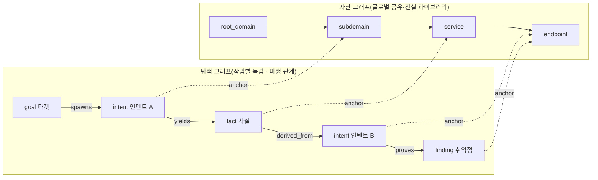
```mermaid
flowchart LR
  subgraph EG["탐색 그래프(작업별 독립 · 파생 관계)"]
    direction TB
    G["goal 타겟"]
    I1["intent 인텐트 A"]
    F1["fact 사실"]
    I2["intent 인텐트 B"]
    FD["finding 취약점"]
    G -->|spawns| I1
    I1 -->|yields| F1
    F1 -->|derived_from| I2
    I2 -->|proves| FD
  end
  subgraph AG["자산 그래프(글로벌 공유·진실 라이브러리)"]
    direction TB
    RD["root_domain"]
    SD["subdomain"]
    SV["service"]
    EP["endpoint"]
    RD --> SD --> SV --> EP
  end
  I1 -. anchor .-> SD
  F1 -. anchor .-> SV
  I2 -. anchor .-> EP
  FD -. anchor .-> EP
```

> 업무 분담: **planner**는 탐사 지도 상황을 읽고 목표를 결정하며, 다루지 않은 새로운 방향이 있을 때만 **의도**를 frontier로 보냅니다. **worker**는 **의도**를 수신하여 실제 도구로 실행하고 새로운 자산/사실/취약점을 두 맵에 다시 기록한 다음 중지합니다. 자산 그래프는 공유된 사실이고, 탐색 그래프는 각 작업의 발전 체인입니다.

### 엔진 및 의도 수명 주기(탐색의 폐쇄 루프)

엔진은 **이벤트 중심** 폐쇄 루프입니다. planner는 그래프가 변경되자마자 깨어나고, planner는 의도를 보내고, worker는 의도를 가져와 실행하고 다시 쓰고, 다시 쓰기는 대상이 입증될 때까지 다음 라운드를 트리거합니다(`prove_goal`).

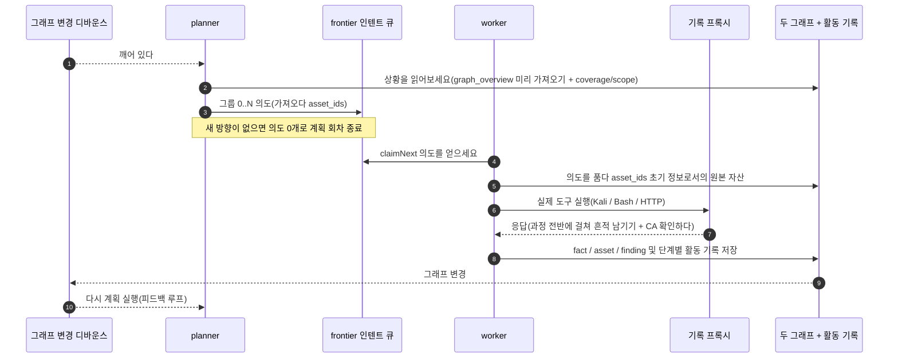
```mermaid
sequenceDiagram
  autonumber
  participant EV as 그래프 변경 디바운스
  participant P as planner
  participant FR as frontier 인텐트 큐
  participant W as worker
  participant PX as 기록 프록시
  participant DB as 두 그래프 + 활동 기록

  EV-->>P: 깨어 있다
  P->>DB: 상황을 읽어보세요(graph_overview 미리 가져오기 + coverage/scope)
  P->>FR: 그룹 0..N 의도(가져오다 asset_ids)
  Note over P,FR: 새 방향이 없으면 의도 0개로 계획 회차 종료
  W->>FR: claimNext 의도를 얻으세요
  W->>DB: 의도를 품다 asset_ids 초기 정보로서의 원본 자산
  W->>PX: 실제 도구 실행(Kali / Bash / HTTP)
  PX-->>W: 응답(과정 전반에 걸쳐 흔적 남기기 + CA 확인하다)
  W->>DB: fact / asset / finding 및 단계별 활동 기록 저장
  DB-->>EV: 그래프 변경
  EV-->>P: 다시 계획 실행(피드백 루프)
```

### worker 간의 프로세스 수준 정보 교환

심층 탐색 중에 worker의 실행 과정에서 많은 귀중한 관찰(특정 오류, 특정 응답, 특정 숨겨진 매개변수)이 나타났지만 공식 fact로 기록되지 않을 수 있습니다. 작업 중복을 방지하고 링크의 worker가 서로의 어깨에 서는 것을 허용하기 위해 worker에는 **work 검색 프로세스를 교차**하는 기능이 있습니다.

- `search_all_worker_traces(q)`: 이 작업의 다른 work 실행 과정에서 키워드로 검색하고(본인 의도의 단계를 자동으로 제외) 히트 항목은 `intent_id`입니다.
- `list_worker_traces` / `get_worker_trace(intent_id, step_ids=[…])`: 먼저 어떤 work가 실행되었는지 확인한 다음 특정 work의 특정 단계의 전체 내용을 교환합니다.

이런 방식으로 탐사 지도에 해당 fact가 없더라도 후속 worker는 프로세스에서 다른 사람의 관찰을 재사용할 수 있습니다. **정보는 "실행 프로세스"의 세분성에서 worker 사이에 흐르고** 경계는 변경되지 않습니다(각 worker는 여전히 수신한 의도만 수행합니다).

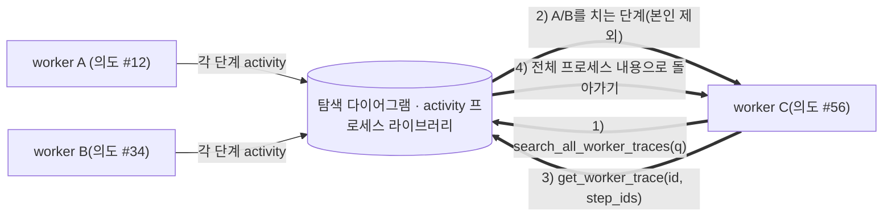
```mermaid
flowchart LR
  WA["worker A (의도 #12)"] -->|"각 단계 activity"| ACT[("탐색 다이어그램 · activity 프로세스 라이브러리")]
  WB["worker B(의도 #34)"] -->|"각 단계 activity"| ACT
  WC["worker C(의도 #56)"] ==>|"1) search_all_worker_traces(q)"| ACT
  ACT ==>|"2) A/B를 치는 단계(본인 제외)"| WC
  WC ==>|"3) get_worker_trace(id, step_ids)"| ACT
  ACT ==>|"4) 전체 프로세스 내용으로 돌아가기"| WC
```

### 플래너의 회차 간 공유 할 일 목록 → 안정적인 공격 경로

실제 공격 체인은 종속성이 있는 다단계 시퀀스인 경우가 많습니다(예: 주입 지점 검색 → 자격 증명 획득 → 횡단 → 권한 에스컬레이션). 한꺼번에 병렬로 보내면 혼란만 생길 뿐입니다. 따라서 planner는 작업별로 유지되고 웨이크 간에 공유되는 계획된 백로그(todolist)를 보유합니다.

- planner는 이벤트 중심입니다. 그래프가 변경되자마자 깨어나지만 각 깨우기는 새로운 세션입니다. 공유 todolist를 사용하면 직렬 활용 체인을 한 번 기록한 다음 한 라운드에서 전체 체인을 펼치는 대신 후속 라운드의 종속성에 따라 점진적으로 의도를 전달할 수 있습니다.
- 각 라운드에서 "이전 단계가 완료되었으며 종속 fact가 이미 존재합니다"에 대한 다음 단계 의도만 전송되고 진행이 진행됨에 따라 목록이 업데이트됩니다(fact에 의해 충족된 단계는 완료로 표시됨).

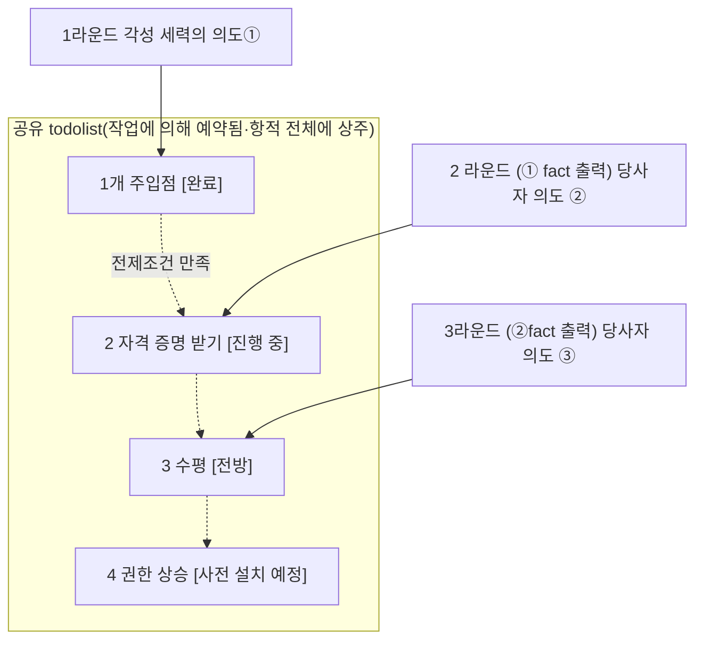
```mermaid
flowchart TB
  subgraph TODO["공유 todolist(작업에 의해 예약됨·항적 전체에 상주)"]
    direction LR
    T1["1개 주입점 [완료]"]
    T2["2 자격 증명 받기 [진행 중]"]
    T3["3 수평 [전방]"]
    T4["4 권한 상승 [사전 설치 예정]"]
    T1 -.전제조건 만족.-> T2 -.-> T3 -.-> T4
  end
  R1["1라운드 각성 세력의 의도①"] --> T1
  R2["2 라운드 (① fact 출력) 당사자 의도 ②"] --> T2
  R3["3라운드 (②fact 출력) 당사자 의도 ③"] --> T3
```

따라서 공격 체인은 "이벤트 중심 + 상태 비저장 세션" 환경에서 중복 및 순서 없이 여전히 안정적으로 진행됩니다. 이것이 ARTEX가 다단계 익스플로잇 체인을 자율적으로 완료하는 능력의 핵심입니다.

---

## 커뮤니케이션 그룹

QR 코드를 스캔하여 WeChat 공식 계정 **SecSentry**를 팔로우하고 공식 계정 백그라운드에서 비공개 메시지를 보내 그룹에 참여하여 소통하세요.

<div align="center">


</div>

---
## 참고 자료

https://github.com/oritera/Cairn


## 라이선스 및 면책조항

### 오픈소스 계약

이 프로젝트는 **GNU Affero General Public License v3.0 (AGPL-3.0)** 라이선스로 배포됩니다. 전체 조항은 저장소 루트의 [LICENSE](LICENSE) 원문을 참고하세요.

이는 누구나 이 프로젝트를 자유롭게 사용, 수정 및 배포할 수 있지만 **2차적 저작물도 AGPL-3.0와 같은 오픈 소스**여야 함을 의미합니다. 특히 **이 프로젝트를 수정하여 네트워크를 통해 사용자에게 제공하는 경우(예: 온라인 서비스로 배포) 해당 사용자에게 해당 전체 소스 코드도 공개해야 합니다**.

> ⚠️ **중요 사항**: 오픈 소스 계약 자체는 소프트웨어 사용을 제한하지 않습니다. 다음 "사용 제한 사항" 및 "면책 조항"은 작성자가 사용자에게 제공하는 추가 계약이자 엄숙한 진술이므로 반드시 준수하시기 바랍니다.

**ARTEX는 개인 학습, 코드 연구 및 현지 기술 검증용으로만 사용되며 온라인 시스템이나 웹사이트의 실제 테스트를 시작하는 데 사용할 수 없습니다. **

### 허용된 사용 범위

- **이 프로젝트의 소스 코드를 읽고 연구하고 연구**하고 **로컬 격리 환경**에서 기술 원리를 확인하는 데에만 사용할 수 있습니다.
- 개인 연구, 학술 연구, 코드 검토 등 공격적이지 않은 목적에 적합합니다.

### 금지사항

- **이 도구를 사용하여 웹사이트, 온라인 서비스 또는 네트워크 시스템을 검사, 탐지, 악용 또는 공격하는 것은 엄격히 금지되어 있습니다**(승인 여부, 자체 자산 여부).
- 실제 침투 테스트, 공격 및 방어 대결 또는 생산 환경에서 이 도구를 사용하는 것은 엄격히 금지됩니다.
- 불법 침입, 데이터 도난, 강탈, 서비스 거부 또는 파괴적이거나 범죄적인 활동에 이 도구를 사용하는 것은 엄격히 금지되어 있습니다.
- 이 도구를 사용하여 귀하가 위치한 국가/지역의 법률 및 규정을 위반하는 활동에 참여하는 것은 엄격히 금지됩니다.

### 규정 준수 책임

사용자는 자신이 위치한 국가/지역의 네트워크 보안, 데이터 보호 및 컴퓨터 범죄에 관한 모든 법률 및 규정("사이버보안법", "데이터 보안법", "개인정보 보호법" 및 중국 본토의 관련 사법 해석을 포함하되 이에 국한되지 않음)을 준수해야 합니다. **이 도구의 사용으로 인해 발생하는 모든 법적 책임과 결과는 사용자에게 있습니다. **

### 부인 성명

이 품목은 명시적이든 묵시적이든 어떠한 종류의 보증도 없이 "있는 그대로(AS IS)" 제공됩니다. 저자와 기여자는 이 도구의 사용으로 인해 발생하는 직간접적인 손실, 데이터 손실, 시스템 손상 또는 법적 분쟁에 대해 책임을 지지 않습니다(부적절하게 사용되었는지 여부에 관계 없음). **이 프로젝트를 다운로드, 설치 또는 사용한다는 것은 위의 모든 약관을 읽고 이해했으며 동의했음을 의미합니다. **
