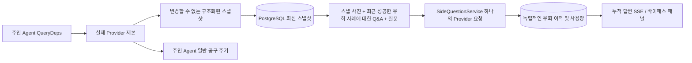

# ARTEX `/btw`

일반 채팅, 작업 MainAgent 및 현재 작업 자체 Worker는 독립적인 우회 질문을 지원합니다. 제출하려면 기본 입력란에 `/btw 질문`를 입력하세요. `/btw`를 비워두거나 "질문 우회" 버튼을 사용하여 기록을 엽니다. 데스크탑에는 너비 조절이 가능한 사이드바를, 모바일에는 Drawer를 사용하세요.

우회 답변은 제출 당시 Agent 컨텍스트 스냅샷을 기반으로 생성되며 스트리밍 표시, 질문, 중지 및 삭제를 지원합니다. 패널을 닫거나 페이지를 새로 고치거나 SSE 연결을 끊어도 모델 요청이 취소되지 않습니다. 정지는 전류 바이패스에만 영향을 미칩니다. 지우면 우회가 취소되고 기본 컨텍스트 스냅샷을 유지하면서 우회 기록이 삭제됩니다.

## 경계를 실현하다

Go, norma v0.3.7, Next.js 및 기존 Markdown / ResizablePanel / Drawer / AlertDialog 구성 요소를 상속합니다. norma 소스 코드를 수정하거나 우회를 위한 종속성을 추가하지 않습니다. 다른 작업에서 상속된 Planner, Worker 및 도구 유형 하위 작업 업그레이드는 이 범위에 포함되지 않습니다.

- `capture.go` `Options.Deps.CallModel / CallModelSync`에는 메인 루프 요청만 표시됩니다. Provider 데코레이터는 라우팅 풀의 외부 선택 후 특정 모델 내부에 위치하므로 실제 선택된 모델이 기록됩니다. 압축 및 다이제스트 요청은 스냅샷을 덮어쓰지 않습니다.
- 시작 요청, 모델 응답 완료, 최종 상태 릴리스 스냅샷 실행. 생성되는 절반 부분 답변은 게시되지 않습니다. 도구 호출은 norma에서 `MessagesForAPI`를 통해 쌍을 이루고 도구 결과는 다음 마스터 모델 요청 또는 최종 상태 실행 시 스냅샷에 입력됩니다. 스트리밍 중단은 마지막으로 유효한 경계를 유지합니다.
- 스냅샷은 JSON 딥 카피를 통해 구조화된 메시지, 시스템 프롬프트, 도구 정의 및 생성 매개변수를 보존합니다. 모델 추론은 스냅샷 잠금이나 데이터베이스 트랜잭션을 유지하지 않습니다.
- `SideQuestionService`는 특정 Provider를 호출합니다. 필요한 경우 우회 요약이 생성되며, 첫 번째 컨텍스트가 범위를 벗어나고 텍스트/도구 호출이 아직 출력되지 않은 경우 축소 후 최종 답변은 한 번만 재시도가 허용됩니다. agent session는 생성되지 않고 도구 실행기, 기본 transcript, 활동 흐름 또는 작업 그래프에 연결되지 않으며 작업 모델 전환 체인을 통과하지 않습니다. 답변은 기존 구조화된 도구 컨텍스트와의 호환성을 위해 도구 정의를 유지합니다. 요약 요청은 도구를 제공하지 않습니다. 새로 반환된 도구 호출에는 실행 경로가 없습니다.
- 상위 세션당 하나의 실행 요청, 최대 4개의 개별 서비스 프로세스 및 120초의 단일 시간 초과. Bypass는 서비스 수명주기에 따라 별도의 취소 컨텍스트를 사용합니다.
- 우회 요청은 모델 구성 참조 및 중요하지 않은 ID 다이제스트를 보존합니다. 자격 증명은 요청 시 기존 구성에서 가져옵니다. 구성이 삭제되거나 모델, 프로토콜, 주소 등의 ID 필드가 변경되면 먼저 기본 Agent 업데이트 스냅샷을 실행해야 합니다. 테스트는 제품 기본 모델을 변경하지 않습니다.

## 지속성과 회복

`db/schema.sql`는 `side_question_sessions` 및 `side_question_requests`를 자동으로 생성합니다. 전자는 상위 리소스, 최신 스냅샷, 실행 번호, 버전 및 클린 버전을 저장합니다. 후자는 질문, 누적 답변, 상태, 모델, 스냅샷 시간, 사용량, 이벤트 일련 번호 및 페이징 일련 번호를 저장합니다.

상위 세션 키는 conversation ID 또는 task ID + exploration ID + intent ID를 사용합니다. Worker 재사용 가능한 실행 슬롯 이름 지정이 사용되지 않습니다.

스냅샷은 상위 세션에 의해 병합 및 작성되고 250 ms마다 새로 고쳐지며 데이터베이스는 `(run_id, version)`를 비교하여 이전 버전을 덮어쓰는 것을 방지합니다. 커밋을 우회하기 전에 선택한 스냅샷을 다시 저장하세요. 성공적으로 저장한 후 메모리의 대형 스냅샷을 해제합니다. 실패 시 보류 중인 버전을 유지합니다. 누적된 답변 내용은 스트리밍 이벤트 도착 시 최대 250 ms마다 한 번씩 작성되며, 최종 상태는 즉시 저장되어 데이터베이스 오류 시 제한된 시간 내에 재시도됩니다.

서비스 시작은 레거시 `running` 요청을 `interrupted`로 표시하고, 삭제된 일부 답변과 사용량을 유지하며, 요청을 자동으로 재생하지 않습니다. 가장 최근에 성공적으로 저장된 컨텍스트는 다음 질문에 직접 사용될 수 있습니다. 스냅샷이 없는 이전 세션에서는 기본 Agent를 먼저 실행해야 하며 UI 활동 레코드에서 컨텍스트를 다시 작성하지 않습니다.

제거 작업은 정리 버전을 늘리고 요청을 삭제합니다. 조건부 업데이트는 늦은 콜백이 다시 기록되는 것을 방지합니다. 물리적 상위 리소스 삭제는 외래 키 계단식을 사용하며 Worker 삭제 표시는 동일한 트랜잭션 내에서 바이패스 데이터를 삭제하고 후속 늦은 스냅샷을 거부합니다. 작업 보관은 먼저 새 요청을 차단하고 기본 프로세스가 중지될 때까지 기다린 후 취소하고 우회가 삭제될 때까지 기다립니다. 아카이브 형식은 v3이며 바이패스 테이블 없이 v1/v2와 호환됩니다.

내역은 완전히 저장되며, 커서는 일련번호별로 페이지당 최대 20개의 항목을 반환할 수 있습니다. 모델은 가장 최근에 성공한 20개의 Q&A 원본 텍스트의 재생을 요청하고 token 예산에 따라 재생 볼륨을 제한합니다. 이전 Q&A는 독립적인 롤링 요약을 유지합니다. 기본 컨텍스트가 예산을 초과하면 바이패스 복사본의 이전 부분만 요약되어 최근의 구조화된 도구 호출 및 결과가 유지됩니다. 요약 및 준비 진행 상황은 사용량과 함께 우회 동시성, 취소, 120초 제한 시간에 포함됩니다. 자세한 내용은 [컨텍스트 예산 및 오픈 소스 참조](CONTEXT_BUDGET.md)를 참조하세요.

## HTTP 계약

`{parent}`는 다음 경로를 사용하며, 기존 인증 및 리소스 검증을 사용합니다.

- `/api/conversations/{id}`
- `/api/tasks/{id}/chat`
- `/api/tasks/{id}/intents/{iid}`

| 요청 | 반품 및 조치 |
| --- | --- |
| `GET {parent}/side-questions?before={ordinal}` | `items`는 새로운 것에서 오래된 것, 독립적인 `current` 실행 상태, `snapshot` 메타 정보, `next_cursor`로 배열됩니다. 커서 0은 최신 페이지를 의미합니다. / 다음 페이지는 없습니다. |
| `POST {parent}/side-questions` | JSON `{ "question": "…", "client_request_id": "UUID" }`; 새 요청은 202와 요청 객체를 반환합니다. 동일한 ID 및 질문은 기존 객체에 대해 200을 반환합니다. |
| `DELETE {parent}/side-questions` | 현재 상위 세션에 대한 바이패스 Q&A 취소 및 삭제 |
| `GET /api/side-questions/{requestID}/events` | `snapshot` SSE 이벤트, `id`는 증분 시퀀스 번호, `data`는 전체 누적 요청 개체입니다. 삭제되면 `cleared`가 전송됩니다. |
| `POST /api/side-questions/{requestID}/cancel` | 명시적 취소 최종 상태는 기록 또는 SSE에서 읽을 수 있습니다. |

질문은 4000자로 제한됩니다. 스냅샷 없음, 모델 구성 변경, 동일한 상위 세션이 사용 중이거나 멱등성 ID 충돌이 409를 반환합니다. 전역 동시성 제한은 429를 반환합니다. 각 SSE 연결은 클라이언트가 수신한 이전 텍스트 조각에 의존하지 않고 먼저 누적 상태를 보냅니다. 프런트 엔드는 요청 ID + 시퀀스 번호에 따라 병합하고 상위 세션을 전환하고 지울 때 이전 콜백을 삭제합니다.

## 검증 및 참조

자동 검사, 실제 모델 사용 및 알려진 제한 사항은 [VALIDATION.md](VALIDATION.md)에서 확인할 수 있습니다.

독립형 요청 참조 [Grok CLI side-question.ts (고정 커밋)](https://github.com/superagent-ai/grok-cli/blob/fb97af83f06dca873281d60168430f06c8de6324/src/utils/side-question.ts), 격리 참조 [OpenCode (고정 커밋)](https://github.com/anomalyco/opencode/tree/b3f1a96c6dd7adeb28b36dd11add1998fc84d67b)을 실행합니다. ARTEX의 컨텍스트는 프런트 엔드 로그의 텍스트를 연결하지 않고 norma의 구조화된 메시지를 사용합니다.
